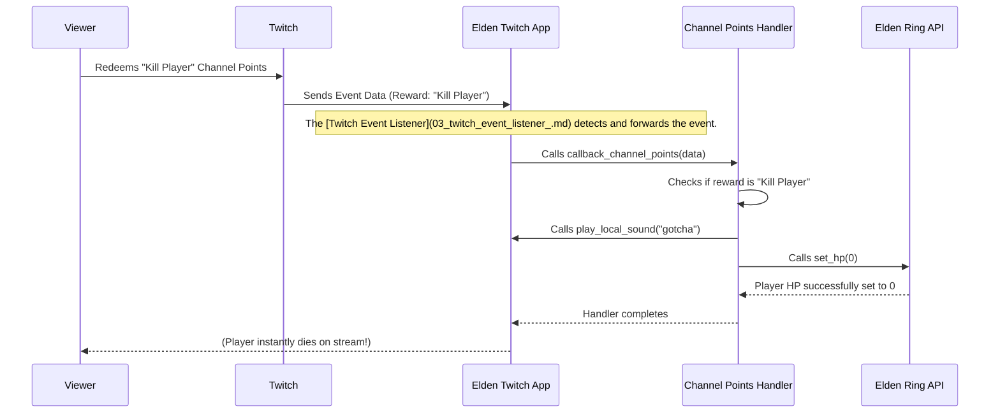

# Chapter 1: Twitch Event Handlers

Imagine you're streaming Elden Ring, and your viewers are eager to interact with your game. Wouldn't it be cool if they could use their Twitch Channel Points or Bits to trigger events directly in your game? Maybe they could heal you, give you runes, or even instantly kill your character for a laugh!

How does this "magic" happen? That's precisely what **Twitch Event Handlers** are for!

## What are Twitch Event Handlers?

Think of Twitch Event Handlers as the "rulebook" or "translator" for your Elden Ring stream. They solve a very specific problem: **how do we turn an action on Twitch into an action in Elden Ring?**

They are like a series of "if-then" statements:
*   **IF** a viewer redeems 'Kill Player' channel points, **THEN** set player HP to zero.
*   **IF** a viewer donates 50 bits, **THEN** also set player HP to zero.
*   **IF** a viewer redeems 'Giant Head' channel points, **THEN** make the player's head giant for a minute!

These handlers listen for Twitch events, figure out what the viewer wants, and then tell the Elden Ring game what to do. They can also play cool sound effects and even manage temporary effects that last for a certain amount of time.

Let's look at a common example: A viewer redeems **"Kill Player"** channel points. How does our program handle this?

## How Handlers Work: A Simple Example

All the core Twitch Event Handlers live in the `src/callbacks.py` file. Let's see how the "Kill Player" event is handled:

```python
# File: src/callbacks.py

# This is our main "event handler" for Twitch Channel Points
def callback_channel_points(uuid: UUID, data: dict) -> None:
    # We look at the 'title' of the reward to know what happened
    reward = data['data']['redemption']['reward']['title']
    print(f"{reward} redeemed!")

    # If the reward is "Kill Player"...
    if reward == "Kill Player":
        play_local_sound("gotcha") # Play a sound effect!
        elden_ring.set_hp(0)       # Set player's health to zero (ouch!)
    # ... there are more 'elif' statements for other rewards ...
```

**Explanation:**

1.  When a viewer redeems channel points on Twitch, this `callback_channel_points` function gets called automatically.
2.  The `data` input contains all the information about the Twitch event. We extract the `reward` name from this data (e.g., "Kill Player").
3.  The `if reward == "Kill Player":` line is our "if-then" rule. If the reward matches, the code inside this block runs.
4.  `play_local_sound("gotcha")` plays a sound effect locally on your computer.
5.  `elden_ring.set_hp(0)` is the crucial part: it tells the Elden Ring game to set your character's Health Points (HP) to zero, instantly killing them! (We'll learn more about `elden_ring` in the next chapter: [Elden Ring Game API](02_elden_ring_game_api_.md)).

Twitch Event Handlers aren't just for Channel Points. They also handle other events like Bits donations:

```python
# File: src/callbacks.py

# This is another handler, this time for Twitch Bits donations
def callback_bits(uuid: UUID, data: dict) -> None:
    # We check how many bits were donated
    amount = data["data"]["bits_used"]
    print(f"{amount} bits redeemed!")

    # If exactly 50 bits are donated...
    if amount == 50:
        play_local_sound("gotcha") # Play a sound!
        elden_ring.set_hp(0)       # Set player's health to zero!
    # ... there are more 'elif' statements for other bit amounts ...
```

**Explanation:** This function works similarly to `callback_channel_points`, but it checks the `amount` of bits donated instead of a reward title. If 50 bits are donated, it also triggers a player kill.

### Handling Temporary Effects

Some Twitch effects are not instant; they last for a period. For example, making your head giant for 60 seconds:

```python
# File: src/callbacks.py
import asyncio # We need this to wait without stopping the whole program

# This function makes your head big for a set amount of time
async def async_head_timer(time):
    # First, remember your normal head size so we can change it back later
    initial_head_size = elden_ring.get_head_size()
    elden_ring.set_head_size(50.0) # Make the head giant!
    play_local_sound("yell")       # Play a fun sound effect!

    await asyncio.sleep(time)      # Wait for the specified 'time' (e.g., 60 seconds)

    elden_ring.set_head_size(initial_head_size) # Restore normal head size
```

**Explanation:**
1.  This `async_head_timer` function is called when someone redeems the "Giant Head" reward.
2.  It saves your current head size, then sets your head to be giant.
3.  The `await asyncio.sleep(time)` line is very important! It pauses *this specific task* for `time` seconds (e.g., 60 seconds), but it *doesn't stop the rest of your program*. This means other Twitch events can still be handled while your head is giant!
4.  After the `time` is up, the code continues, and your head size is set back to normal.

### Playing Local Sounds

To make the experience more engaging, handlers can play local sound effects:

```python
# File: src/callbacks.py
import os
from playsound import playsound
from settings import Settings as settings # To check if sounds are muted

# A helper function to play sound files stored locally
def play_local_sound(sound):
    # Check if sounds are not muted in the settings
    if settings.MUTED == "false":
        dirname = os.path.dirname(__file__)
        # Construct the full path to the sound file (e.g., 'sounds/gotcha.wav')
        filename = os.path.join(dirname, f'sounds\\{sound}.wav')
        playsound(filename) # Play the sound!
```

**Explanation:** This simple function takes a sound name (like "gotcha") and plays the corresponding `.wav` file from your `sounds` folder. It also checks your settings to ensure sounds aren't muted.

## Inside the `elden_twitch` App: How it all Connects

Let's visualize the journey of a "Kill Player" channel points redemption through the system:



**Diagram Explanation:**

1.  **Viewer Action:** A viewer initiates an action on Twitch (like redeeming Channel Points).
2.  **Twitch Notifies App:** Twitch sends a message containing the event details to our `Elden Twitch App`.
3.  **Event Listener:** Inside our app, a special component called the [Twitch Event Listener](03_twitch_event_listener_.md) (which we'll cover later!) is always listening. It receives the message and knows which handler function to call.
4.  **Handler Invoked:** The `Elden Twitch App` calls the appropriate event handler function, in this case, `callback_channel_points`.
5.  **Handler Logic:** The `Channel Points Handler` function (our `callback_channel_points`) processes the `data` it received. It checks the reward name and finds the "Kill Player" rule.
6.  **Game Interaction:** Based on the rule, the handler calls functions from the [Elden Ring Game API](02_elden_ring_game_api_.md) (like `set_hp(0)`) to modify the game. It also plays local sounds.
7.  **Result:** The game state changes (your player dies!), and you and your viewers see the effect instantly on stream.

## A Peek Behind the Curtain in `src/callbacks.py`

At the very top of `src/callbacks.py`, you'll find these important lines:

```python
# File: src/callbacks.py

from elden_ring import EldenRingMod # Import the tool to talk to Elden Ring
elden_ring = EldenRingMod()       # Create an 'elden_ring' object we can use
                                  # to change things in the game!
# ... rest of the file ...
```

**Explanation:**

*   `from elden_ring import EldenRingMod`: This line tells our program to bring in a special "toolkit" called `EldenRingMod`. This toolkit contains all the functions needed to interact with the Elden Ring game.
*   `elden_ring = EldenRingMod()`: This line creates a specific "instance" of that toolkit, named `elden_ring`. Now, whenever you see `elden_ring.something()`, it means we are using this toolkit to perform an action directly within the Elden Ring game. This is how our handlers are able to control the game!

## Conclusion

You've learned that Twitch Event Handlers are the core "rules" that translate viewer actions on Twitch into exciting events within your Elden Ring game. They use `if-then` logic, can manage temporary effects with timers, and enhance the experience with sound effects. You've also seen how they use a special `elden_ring` object to talk to the game.

But how exactly does `elden_ring.set_hp(0)` actually change your health in the game? How does it communicate with Elden Ring? That's what we'll dive into in the next chapter, where we explore the powerful [Elden Ring Game API](02_elden_ring_game_api_.md)!

---

<sub><sup>Generated by [AI Codebase Knowledge Builder](https://github.com/The-Pocket/Tutorial-Codebase-Knowledge).</sup></sub> <sub><sup>**References**: [[1]](https://github.com/zteisberg/elden_twitch/blob/947b5ea5e444c7d248dcac1b11d0315929c6a93e/src/callbacks.py)</sup></sub>