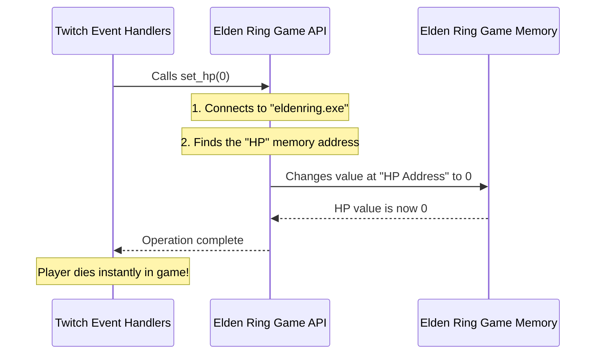

# Chapter 2: Elden Ring Game API

In the last chapter, [Twitch Event Handlers](01_twitch_event_handlers_.md), we saw how our program listens for Twitch events and decides what to do. For example, when a viewer redeems "Kill Player" channel points, our handler calls `elden_ring.set_hp(0)`.

But wait, how does `elden_ring.set_hp(0)` actually work its magic? How does our Python code reach into the running Elden Ring game and change something as fundamental as your character's health? That's exactly where the **Elden Ring Game API** comes in!

## What Problem Does the Elden Ring Game API Solve?

Imagine you have a super complex machine, like a spaceship. Instead of having to learn how to rewire the circuits or adjust every single dial manually, wouldn't it be easier if you had a simple **control panel** with clear buttons and readouts?

The Elden Ring Game API is that "control panel" for the Elden Ring game.

**The big problem it solves is this:** Elden Ring is a highly complex program running on your computer. Our Python script usually can't just "talk" to it directly. The game stores all its information—your HP, your runes, even the size of your character's head—in specific spots in your computer's memory. These spots are just numbers, like an address on a street. Dealing with these raw memory addresses is extremely difficult and error-prone.

The Elden Ring Game API acts as a **bridge** between our easy-to-use Python code and the game's deep, complex internal workings. It lets us do things like `set_hp(0)` or `get_runes()` without having to worry about the messy details of computer memory.

## How It Works: Your Game's "Remote Control"

Think of the Elden Ring Game API as a special **remote control** for your Elden Ring game.

*   You press a button on the remote (e.g., `set_hp(0)`).
*   The remote (Elden Ring Game API) knows exactly which complex signals to send to the TV (Elden Ring game).
*   The TV (game) then responds by changing the channel or adjusting the volume (changing your HP).

This remote control gives us a set of simple, clear functions (like buttons on a remote) that do specific things in the game:

| Function                | What it Does                                 | Example Use Case                                      |
| :---------------------- | :------------------------------------------- | :---------------------------------------------------- |
| `set_hp(amount)`        | Sets your character's Health Points.         | `elden_ring.set_hp(0)` (insta-kill!)                  |
| `get_runes()`           | Reads how many runes your character has.     | `current_runes = elden_ring.get_runes()`              |
| `set_head_size(amount)` | Changes the size of your character's head.   | `elden_ring.set_head_size(50.0)` (giant head!)        |
| `get_level()`           | Reads your character's current level.        | `level = elden_ring.get_level()`                      |
| `set_stamina(amount)`   | Sets your character's stamina.               | `elden_ring.set_stamina(9999)` (unlimited stamina!)   |

It's all about making complex actions simple for us!

## Using the Elden Ring Game API

All the code for our Elden Ring Game API lives in the `src/elden_ring.py` file.

Remember from [Chapter 1](01_twitch_event_handlers_.md) how we created an `elden_ring` object?

```python
# File: src/callbacks.py (revisiting from Chapter 1)
from elden_ring import EldenRingMod # Bring in our 'remote control' toolkit
elden_ring = EldenRingMod()       # Create a specific 'remote control' to use
```

Once we have this `elden_ring` object, we can use its functions to interact with the game.

### Example: Setting Your HP

Here's how easy it is to set your HP:

```python
# This would be inside one of our Twitch Event Handlers
# For example, if a viewer redeems "Heal Player"
elden_ring.set_hp(1000) # Sets your character's HP to 1000.
                        # (Your character gets a sudden burst of health!)
```

This one line of code calls a function on our `elden_ring` object, and the API takes care of all the behind-the-scenes work to make it happen in the game.

### Example: Getting Your Runes

We can also read information from the game, like how many runes you have:

```python
# This could be used by a Game State Monitor (Chapter 4)
# or to check if a player has enough runes for an event.
current_runes = elden_ring.get_runes()
print(f"You currently have {current_runes} runes!")
# (Output: "You currently have 12345 runes!")
```

The `get_runes()` function goes into the game's memory, finds the rune count, and brings that number back to our Python script.

### Example: Changing Your Head Size

And for those fun, temporary effects:

```python
# From Chapter 1, when "Giant Head" is redeemed
initial_head_size = elden_ring.get_head_size() # Remember normal size
elden_ring.set_head_size(50.0)                 # Make the head giant!
# ... wait for some time ...
elden_ring.set_head_size(initial_head_size)    # Restore normal head size
```

These simple functions allow us to create all sorts of dynamic and entertaining interactions with the game!

## Behind the Scenes: How the API Talks to Elden Ring

So, how does this "remote control" actually work? It's a bit like a special translator that speaks the computer's memory language.

### Step-by-Step Walkthrough

1.  **Connecting to the Game:** When `elden_ring = EldenRingMod()` is called, the API first finds the running "eldenring.exe" program on your computer. It needs to "attach" to it, like plugging in the remote control.
2.  **Finding the "Address":** Imagine the game's memory is a giant library with millions of books. Each book contains a piece of information (like your HP, or rune count). To change your HP, the API needs to know the exact "shelf number" and "book number" where your HP value is stored. This "shelf and book number" is called a **memory address**.
3.  **Reading or Writing:**
    *   **To get information (e.g., `get_runes()`):** The API goes to the specific memory address for runes, reads the number stored there, and gives it back to your Python script.
    *   **To change information (e.g., `set_hp(0)`):** The API goes to the specific memory address for HP and replaces the old number with `0`.

### The Elden Ring API in Action



This diagram shows how a simple function call in our event handler is translated by the Elden Ring Game API into a direct change in the game's memory.

## A Look Inside `src/elden_ring.py` (Simplified)

Let's peek at some simplified parts of the `src/elden_ring.py` file to see how this memory interaction happens.

### The Constructor: Getting Ready

When we create `elden_ring = EldenRingMod()`, this special setup code runs:

```python
# File: src/elden_ring.py

import pymem # This is a powerful tool to interact with computer memory

class EldenRingMod:
    def __init__(self):
        # 1. Connect to the Elden Ring process (the running game)
        self.pm = pymem.Pymem('eldenring.exe')
        # ... (complex code to find memory addresses is here) ...
        print("Elden Ring Connection Ready")
```

**Explanation:**
*   `import pymem`: This line brings in a Python library called `pymem`. This library is our key tool for reading and writing to the memory of other running programs (like Elden Ring).
*   `self.pm = pymem.Pymem('eldenring.exe')`: This is the crucial step! It tells `pymem` to find the Elden Ring game (which runs as `eldenring.exe`) and prepare to interact with its memory.
*   The lines we skipped (`... complex code ...`) are what the API uses to *discover* where important pieces of information (like HP, runes, head size) are stored in the game's memory. This process is actually quite involved, and we'll explore it in more detail in [Memory Address Discovery](05_memory_address_discovery_.md). For now, just know that the API figures out these "secret locations."

### Getting and Setting HP

Now, let's look at how `get_hp()` and `set_hp()` work:

```python
# File: src/elden_ring.py (simplified)

class EldenRingMod:
    # ... (other code like __init__ is above) ...

    def get_hud_base_address(self):
        # This function finds a starting point in memory for many HUD-related values
        # (HP, FP, Stamina are all relative to this 'base' address)
        return self.hud_address_pointer + 0x1234 # Simplified example address

    def get_hp_address(self):
        # Calculates the exact memory address where HP is stored
        # It adds a small number (called an 'offset') to the base address
        return self.get_hud_base_address() + 0x138

    def get_hp(self):
        # Reads the integer (whole number) value from the HP memory address
        return pymem.memory.read_int(self.pm.process_handle, self.get_hp_address())

    def set_hp(self, amount):
        # Writes an integer value (the 'amount') to the HP memory address
        pymem.memory.write_int(self.pm.process_handle, self.get_hp_address(), amount)
```

**Explanation:**
*   `get_hud_base_address()` and `get_hp_address()`: These functions are smart. They don't just use a fixed number for the HP address because these addresses can change every time you start the game! Instead, they calculate the correct address dynamically. The `0x138` is a small fixed "offset" (like a room number within a building) from a larger "base address" (the building's street address) that points to your HP.
*   `pymem.memory.read_int(...)`: This `pymem` function does the actual work of looking into the game's memory at the calculated address and fetching the integer (whole number) value (your HP).
*   `pymem.memory.write_int(...)`: This `pymem` function writes a new integer value (`amount`) directly into the game's memory at the HP address, changing your health!

### Getting and Setting Head Size

Changing values like head size works in a very similar way:

```python
# File: src/elden_ring.py (simplified)

class EldenRingMod:
    # ... (other code is above) ...

    def get_stats_base_address(self):
        # Finds a starting point in memory for many character stats
        return self.stats_base_address_pointer + 0x5678 # Simplified example address

    def get_head_size_address(self):
        # Calculates the exact memory address for head size
        return self.get_stats_base_address() + 0x870

    def get_head_size(self):
        # Reads a float (decimal number) value from the head size memory address
        return pymem.memory.read_float(self.pm.process_handle, self.get_head_size_address())

    def set_head_size(self, amount):
        # Writes a float value (the 'amount') to the head size memory address
        pymem.memory.write_float(self.pm.process_handle, self.get_head_size_address(), amount)
```

**Explanation:**
*   It's the same pattern! Find a base address, add an offset to get the specific address, and then use `pymem` to `read_float` or `write_float` (because size values are often decimal numbers, not just whole numbers).

The beauty of the Elden Ring Game API is that it wraps all these complex `pymem` calls and memory address calculations into simple, understandable functions that our [Twitch Event Handlers](01_twitch_event_handlers_.md) can use easily.

## Conclusion

You've now learned that the Elden Ring Game API is the vital "control panel" or "remote control" that allows our Python program to interact directly with the Elden Ring game. It translates simple function calls like `set_hp(0)` into complex operations that read from or write to the game's memory using powerful tools like `pymem`. By hiding these intricate details, the API makes it possible for us to create exciting and dynamic Twitch-integrated experiences.

But how does our `Elden Twitch App` even know when a viewer redeems channel points or donates bits? Who is always watching Twitch for these events? That's what we'll uncover in our next chapter, where we explore the **[Twitch Event Listener](03_twitch_event_listener_.md)**!

---

<sub><sup>Generated by [AI Codebase Knowledge Builder](https://github.com/The-Pocket/Tutorial-Codebase-Knowledge).</sup></sub> <sub><sup>**References**: [[1]](https://github.com/zteisberg/elden_twitch/blob/947b5ea5e444c7d248dcac1b11d0315929c6a93e/src/elden_ring.py)</sup></sub>