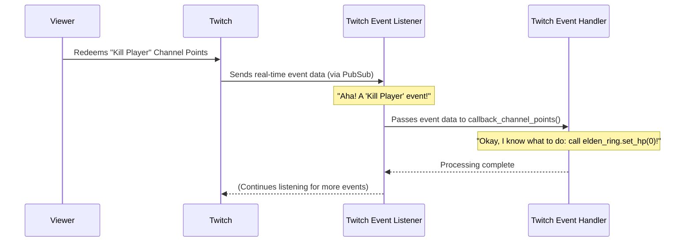

# Chapter 3: Twitch Event Listener

In our last chapter, [Elden Ring Game API](02_elden_ring_game_api_.md), we explored how our program can send commands to Elden Ring (like `elden_ring.set_hp(0)`) and read information from it. We learned about the "remote control" that lets our Python code talk to the game's memory.

But how does our `Elden Twitch App` even know *when* a viewer redeems channel points or donates bits? Who is always watching Twitch for these exciting events? That's the job of the **Twitch Event Listener**!

## What Problem Does the Twitch Event Listener Solve?

Imagine `elden_twitch` as a helpful assistant for your stream. The [Twitch Event Handlers](01_twitch_event_handlers_.md) are like the assistant's "brain" that knows what to do, and the [Elden Ring Game API](02_elden_ring_game_api_.md) is its "hands" that interact with the game.

But before the brain can think or the hands can act, the assistant needs "ears" to hear what's happening!

**The core problem the Twitch Event Listener solves is this:** Twitch events (like channel point redemptions, bit donations, or new subscriptions) happen in real-time on Twitch's servers. Our application, running on your computer, needs a way to *constantly monitor* for these events as they occur, capture all the details, and then pass them on for processing.

The Twitch Event Listener is like the **dedicated "ears" of our application**, always tuned into your Twitch channel, waiting for specific viewer interactions.

## How It Works: Your Real-time Twitch Monitor

Think of the Twitch Event Listener as a super-attentive secretary sitting by the phone, specifically waiting for calls from Twitch.

Here’s how it operates:

1.  **Connects to Twitch:** It first "dials into" Twitch's special real-time messaging service, called **PubSub**.
2.  **Identifies Itself:** It shows Twitch its "credentials" (your Twitch account information) to prove it's allowed to listen to your channel's events.
3.  **Subscribes to Events:** It tells Twitch, "Hey, please send me a notification whenever there's a channel point redemption, a bit donation, or a new subscription on my channel!"
4.  **Listens Actively:** It then sits there, constantly listening.
5.  **Receives and Forwards:** When an event happens (e.g., a viewer redeems "Kill Player"), Twitch sends a message to our Listener. The Listener immediately captures all the details of that message and quickly passes it to the appropriate [Twitch Event Handlers](01_twitch_event_handlers_.md) to figure out what to do next.

This means you don't have to constantly check Twitch manually; the Listener does it all for you, in real-time!

## Using the Twitch Event Listener

The Twitch Event Listener is the *starting point* of our application's interaction with Twitch. You don't directly "call" the Listener; instead, you *start* it, and it then runs continuously in the background, making all other interactions possible.

The main function that starts our listener is called `start_sub()`, and it's located in the `src/pubsub.py` file.

Here's how our entire application kicks off the listening process:

```python
# File: src/elden_twitch.py

from pubsub import start_sub # Bring in our 'start_sub' function

if __name__ == '__main__':
    start_sub() # Start listening to Twitch events!
```

**Explanation:**

*   `from pubsub import start_sub`: This line imports the `start_sub` function from our `pubsub.py` file.
*   `if __name__ == '__main__':`: This is a standard Python way to say, "When this script is run directly, do this..."
*   `start_sub()`: This is the magical call that wakes up our Twitch Event Listener and gets it going!

Once `start_sub()` is called, our application is officially listening for events on your Twitch channel.

### The Listener in Action: A "Kill Player" Redemption

Let's revisit our "Kill Player" example and see the Listener's role:



**Diagram Explanation:**

1.  **Viewer Action:** A viewer redeems "Kill Player" channel points on your Twitch stream.
2.  **Twitch Notifies Listener:** Twitch's PubSub service immediately sends a message with all the event details to our `Twitch Event Listener`.
3.  **Listener Forwards:** The Listener receives this message and, knowing it's a channel points redemption, passes the message to the `callback_channel_points` function in our [Twitch Event Handlers](01_twitch_event_handlers_.md).
4.  **Handler Acts:** The handler then processes the data and tells the [Elden Ring Game API](02_elden_ring_game_api_.md) to kill the player.

The Listener's job is purely to be the first point of contact and hand off the information. It doesn't decide *what* to do, only *that* something happened.

## Behind the Scenes: How the Listener Connects to Twitch

Now, let's peek inside the `src/pubsub.py` file to see how `start_sub()` works its magic.

### 1. Setting up Twitch Connection

The Listener needs to use special tools (libraries) to talk to Twitch. It also needs to know your Twitch App ID, App Secret, and Channel Name, which are loaded from your `settings`.

```python
# File: src/pubsub.py (simplified)
import asyncio # For running asynchronous tasks
from twitchAPI import UserAuthenticator, Twitch # Tools for Twitch connection
from twitchAPI.pubsub import PubSub # Our real-time listener tool
from twitchAPI.types import AuthScope # What permissions we need

import callbacks # Where our event handler functions live
from settings import Settings as settings # Our application settings

def start_sub():
    # 1. Connect to Twitch using your App ID and Secret
    twitch = Twitch(settings.APP_ID, settings.APP_SECRET)
    twitch.authenticate_app([]) # Basic app authentication
    # ... more code ...
```

**Explanation:**

*   `import ...`: These lines bring in the necessary toolkits from the `twitchAPI` library.
*   `Twitch(settings.APP_ID, settings.APP_SECRET)`: This creates a connection object using your application's unique ID and secret. Think of it as plugging in your "Twitch modem."
*   `twitch.authenticate_app([])`: This step makes sure our application is recognized by Twitch.

### 2. Getting Permission to Listen (Authentication)

To listen to *your* channel's events, the Listener needs your explicit permission (like a personal login). This is handled by **authentication scopes** and a **user authenticator**.

```python
# File: src/pubsub.py (simplified)
# ... (code from above) ...

def start_sub():
    # ... (code from above) ...

    # 2. Tell Twitch what kind of events we want to listen to (permissions)
    target_scope = [
        AuthScope.BITS_READ,           # Permission to read bit donations
        AuthScope.CHANNEL_READ_REDEMPTIONS, # Permission to read channel point redemptions
        AuthScope.CHANNEL_READ_SUBSCRIPTIONS # Permission to read subscriptions
        # ... other permissions ...
    ]
    # This helps us log into your Twitch account for specific permissions
    auth = UserAuthenticator(twitch, target_scope, force_verify=False)
    # This gets the special token (like a temporary password)
    token, refresh_token = auth.authenticate()
    twitch.set_user_authentication(token, target_scope, refresh_token)
    # ... more code ...
```

**Explanation:**

*   `target_scope`: This list defines *what* our application is allowed to monitor. We specifically ask for permissions to read bits, channel points, and subscriptions.
*   `UserAuthenticator(...)`: This component handles the process of getting a special access token. When you run `elden_twitch` for the first time, it might open a browser window asking you to log into Twitch and grant these permissions.
*   `token, refresh_token = auth.authenticate()`: Once you grant permission, Twitch gives us a `token` (a temporary key) that lets our app listen to your channel.

### 3. Finding Your Channel's ID

Twitch prefers to work with unique ID numbers rather than channel names. So, after authenticating, the Listener fetches your channel's ID.

```python
# File: src/pubsub.py (simplified)
# ... (code from above) ...

def start_sub():
    # ... (code from above) ...

    # 3. Get the unique ID for your Twitch channel name
    user = twitch.get_users(logins=[settings.CHANNEL_NAME])
    user_id = user['data'][0]['id'] # Extract the ID from the response
    # ... more code ...
```

**Explanation:**

*   `twitch.get_users(logins=[settings.CHANNEL_NAME])`: We use the `Twitch` tool to look up your channel (from `settings.CHANNEL_NAME`) and get its unique `user_id`.

### 4. Starting the PubSub Listener

With all the preparation done, we can finally start the real-time PubSub listener and tell it *which specific events* to monitor on your channel and *which functions* to call when those events happen.

```python
# File: src/pubsub.py (simplified)
# ... (code from above) ...

def start_sub():
    # ... (code from above) ...

    uuids = [] # To keep track of our listeners
    pubsub = PubSub(twitch) # Create our PubSub listener object
    pubsub.start()          # Start the PubSub connection!

    # 4. Tell PubSub to listen for specific events and what function to call
    #    when they happen (our event handlers from Chapter 1!)
    uuids.append(pubsub.listen_channel_points(user_id, callbacks.callback_channel_points))
    uuids.append(pubsub.listen_bits(user_id, callbacks.callback_bits))
    uuids.append(pubsub.listen_channel_subscriptions(user_id, callbacks.callback_subs))

    input('press ENTER to close...') # Keep the program running until you press Enter
    print()
    for uuid in uuids:
        pubsub.unlisten(uuid) # Stop listening when done
    pubsub.stop()             # Close the PubSub connection
```

**Explanation:**

*   `pubsub = PubSub(twitch)`: This creates the actual "listener" object.
*   `pubsub.start()`: This command opens the real-time connection to Twitch's PubSub service.
*   `pubsub.listen_channel_points(user_id, callbacks.callback_channel_points)`: This is the most important part! It tells PubSub: "For this `user_id` (your channel), please listen for any `channel_points` redemptions. When one happens, call the `callbacks.callback_channel_points` function and pass it the event data!"
*   Similar lines exist for `listen_bits` and `listen_channel_subscriptions`, connecting them to their respective functions in `src/callbacks.py`.
*   `input('press ENTER to close...')`: This line simply keeps our Python program running indefinitely until you manually press Enter in the console, ensuring the Listener stays active.
*   The lines with `unlisten` and `pubsub.stop()` are for gracefully shutting down the connection when the program exits.

## Conclusion

The Twitch Event Listener is the critical "ears" of our `elden_twitch` application. It constantly monitors your Twitch channel in real-time for specific viewer interactions like channel point redemptions, bit donations, and new subscriptions. By connecting to Twitch's PubSub service and using your authenticated credentials, it reliably captures these events and passes them on to our [Twitch Event Handlers](01_twitch_event_handlers_.md) for processing. It's what makes the entire interactive experience possible!

But wait, how does our program know what's happening *inside* the Elden Ring game without a viewer input? How can it tell if you've died, if you're in a boss fight, or if your runes have changed? That's what we'll explore in our next chapter, the **[Game State Monitor](04_game_state_monitor_.md)**!

---

<sub><sup>Generated by [AI Codebase Knowledge Builder](https://github.com/The-Pocket/Tutorial-Codebase-Knowledge).</sup></sub> <sub><sup>**References**: [[1]](https://github.com/zteisberg/elden_twitch/blob/947b5ea5e444c7d248dcac1b11d0315929c6a93e/src/elden_twitch.py), [[2]](https://github.com/zteisberg/elden_twitch/blob/947b5ea5e444c7d248dcac1b11d0315929c6a93e/src/pubsub.py), [[3]](https://github.com/zteisberg/elden_twitch/blob/947b5ea5e444c7d248dcac1b11d0315929c6a93e/src/settings.py)</sup></sub>