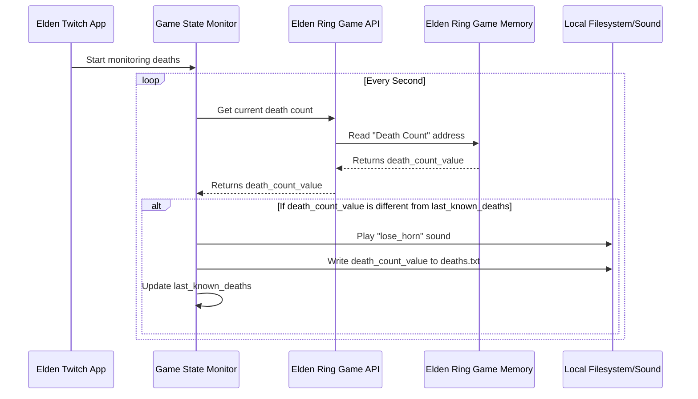

# Chapter 4: Game State Monitor

In our previous chapter, [Twitch Event Listener](03_twitch_event_listener_.md), we learned how our `elden_twitch` application acts as the "ears" for your stream, catching all the real-time actions from your viewers on Twitch. We saw how events like channel point redemptions trigger specific reactions in your game.

But what if we want our program to react to things happening *inside* the Elden Ring game itself, without any direct input from Twitch? For example, wouldn't it be cool if our stream automatically kept track of how many times you've died, played a special sound, and even updated a file with your current death count?

This is where the **Game State Monitor** comes in!

## What Problem Does the Game State Monitor Solve?

Imagine you have a loyal "silent observer" or a "watchdog" that is *always* looking at certain things happening in your Elden Ring game. This observer doesn't wait for a viewer to trigger something. Instead, it constantly checks for specific changes, and when it sees one, it reacts!

**The core problem it solves is this:** How do we track persistent game events and trigger actions based on them, *independently* of direct Twitch commands? We want to know when your character dies, when you enter a boss fight, or when your rune count changes, even if no one sends a Twitch command.

The Game State Monitor is that "watchdog," continuously peeking into the game to detect these important changes.

## How It Works: Your Game's Silent Watchdog

Think of the Game State Monitor as a special agent running in the background, constantly on patrol. Here’s its routine:

1.  **Chooses What to Watch:** It knows exactly which piece of information in the game's memory it needs to keep an eye on (like your character's death count).
2.  **Reads Value:** Every short period (e.g., every second), it discreetly reads the *current* value of that information from the game.
3.  **Compares:** It then compares this *current* value to the *last value* it saw.
4.  **Reacts if Changed:** If the value has changed (for example, your death count has increased), it triggers a specific set of actions, such as playing a sound, updating a file, or sending a message.
5.  **Continues Watching:** It then goes back to step 2, continuously monitoring for the next change.

This allows `elden_twitch` to be aware of what's happening in your game and react automatically, enhancing the stream experience even without direct viewer interaction.

## Our Use Case: Tracking Player Deaths

Let's use the player death count as our primary example. Our goal is to:

1.  Continuously check the player's death count in Elden Ring.
2.  If the death count increases, play a "lose horn" sound effect.
3.  Update a local file named `deaths.txt` with the new total. This file can then be displayed on your stream using overlays!

## Behind the Scenes: The Death Monitor in Action

Let's visualize how our Game State Monitor tracks your deaths:



**Diagram Explanation:**

1.  **App Starts Monitoring:** When `elden_twitch` starts, it tells the `Game State Monitor` to begin watching for changes in your death count.
2.  **Continuous Loop:** The `Game State Monitor` enters a continuous loop, checking for updates every second.
3.  **Get Death Count:** It uses the [Elden Ring Game API](02_elden_ring_game_api_.md) to ask the game for the current number of deaths.
4.  **Read from Memory:** The [Elden Ring Game API](02_elden_ring_game_api_.md) then directly reads this value from the game's memory.
5.  **Compare and React:** The `Game State Monitor` compares the new death count with the last one it recorded. If they are different (meaning you just died!), it springs into action:
    *   It plays a "lose horn" sound.
    *   It updates the `deaths.txt` file on your computer.
    *   It remembers this new death count for the next check.
6.  **Loop Continues:** The process repeats, always keeping an eye on your in-game deaths.

## A Look Inside `src/callbacks.py` (Simplified)

The core logic for our Game State Monitor, specifically for tracking deaths, lives in an asynchronous function called `write_death_counter()` within `src/callbacks.py`. This function runs in the background, constantly performing its monitoring duties.

Let's break it down:

```python
# File: src/callbacks.py

# ... other imports and code ...

elden_ring = EldenRingMod() # Our Elden Ring 'remote control' from Chapter 2

# This function constantly monitors the game state
async def write_death_counter():
    dirname = os.getcwd() # Get current folder path
    filename = os.path.join(dirname, f'deaths.txt') # Create path for deaths.txt
    print(f"Monitoring deaths and writing to {filename}")

    deaths = 0 # Keep track of the last known death count

    while True: # This loop runs forever!
        # The 'with suppress' helps our program not crash if there's a tiny error
        with suppress(Exception):
            # 1. Get the current death count from Elden Ring (using our API!)
            new_deaths = elden_ring.get_deaths()

            # 2. Compare: Has the death count changed?
            if deaths != new_deaths:
                # 3. React: Write the new death count to the file
                with open(filename, mode='w') as f:
                    f.write(str(new_deaths))
                # Update our stored death count
                deaths = new_deaths
                # 4. React: Play a sound effect!
                play_local_sound("lose_horn")
        
        # Wait for 1 second before checking again
        await asyncio.sleep(1)
```

**Explanation:**

*   `elden_ring = EldenRingMod()`: This line, as you remember from [Elden Ring Game API](02_elden_ring_game_api_.md), gives us our "remote control" (`elden_ring` object) to talk to the game.
*   `async def write_death_counter():`: This defines our monitoring function. The `async` keyword means it can run in the background without blocking the rest of the application.
*   `deaths = 0`: We start by assuming 0 deaths. This variable will store the *last known* death count.
*   `while True:`: This is a crucial loop! It ensures that the code inside it runs continuously, forever, making it a constant monitor.
*   `elden_ring.get_deaths()`: This is where our [Elden Ring Game API](02_elden_ring_game_api_.md) comes into play. This function reads the current death count directly from the Elden Ring game's memory.
*   `if deaths != new_deaths:`: This is the comparison step. If the newly read death count (`new_deaths`) is different from what we last recorded (`deaths`), it means a death has occurred.
*   `with open(filename, mode='w') as f:`: This code opens our `deaths.txt` file. The `mode='w'` means it will overwrite the file with the new count (this is fine for a simple counter).
*   `f.write(str(new_deaths))`: The new death count is written into the `deaths.txt` file. We convert the number to text (`str()`) because files store text.
*   `deaths = new_deaths`: We update our `deaths` variable so that the next time the loop runs, it compares against this latest count.
*   `play_local_sound("lose_horn")`: We trigger a sound effect to make the death more impactful!
*   `await asyncio.sleep(1)`: This line is very important! It tells our function to "pause" for 1 second before checking the game again. Because it's an `async` function, this pause doesn't stop the rest of `elden_twitch` (like the [Twitch Event Listener](03_twitch_event_listener_.md) or other handlers) from working.

### How it Starts Running

You might be wondering, "How does `write_death_counter()` even begin its `while True` loop?"
Our `elden_twitch` application knows to start this monitor as soon as it launches. It's added to the list of background tasks to run continuously. You can find the line that kicks it off in `src/pubsub.py`:

```python
# File: src/pubsub.py (simplified)

import asyncio # Needed for running background tasks
import callbacks # Our file with the monitoring function

def start_sub():
    # ... (other setup code) ...

    # This line tells our program to start the death counter monitor
    asyncio.ensure_future(callbacks.write_death_counter())

    input('press ENTER to close...') # Keeps the program running
    # ... (cleanup code) ...
```

The `asyncio.ensure_future(callbacks.write_death_counter())` line makes sure that our death counter starts running silently in the background right after the application launches and continues monitoring while the Twitch Event Listener is active.

## Conclusion

The Game State Monitor is the "silent observer" of your Elden Ring game. It continuously watches for specific changes in the game's state, like your player's death count, and then triggers automated reactions such as playing sounds and updating external files. By leveraging the [Elden Ring Game API](02_elden_ring_game_api_.md) and running in the background, it adds an extra layer of dynamic interaction to your stream, independent of direct viewer commands.

But how do we know *where* in the game's memory to look for your HP, runes, or death count? How do we find those "secret addresses" that the [Elden Ring Game API](02_elden_ring_game_api_.md) uses? That fascinating process is what we'll explore in our next chapter, **[Memory Address Discovery](05_memory_address_discovery_.md)**!

---

<sub><sup>Generated by [AI Codebase Knowledge Builder](https://github.com/The-Pocket/Tutorial-Codebase-Knowledge).</sup></sub> <sub><sup>**References**: [[1]](https://github.com/zteisberg/elden_twitch/blob/947b5ea5e444c7d248dcac1b11d0315929c6a93e/src/callbacks.py)</sup></sub>