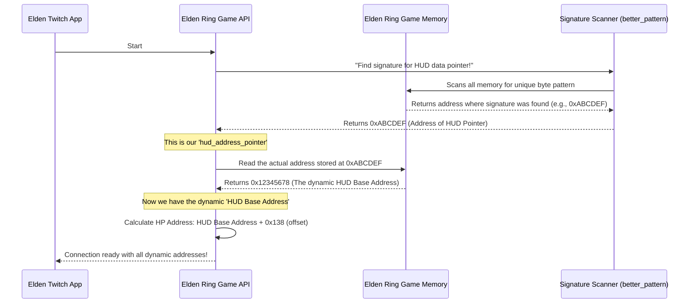

# Chapter 5: Memory Address Discovery

In our last chapter, [Game State Monitor](04_game_state_monitor_.md), we saw how our `elden_twitch` app could constantly peek into the game to find out things like your current death count. But how does `elden_ring.get_deaths()` know *where* in the game's vast memory to look for that number? How does it find your HP, your runes, or even the address that controls your character's head size?

This is where **Memory Address Discovery** comes in, and it's like having a special "treasure map finder" built right into our application!

## What Problem Does Memory Address Discovery Solve?

Imagine Elden Ring's internal memory as a giant, ever-changing library. All the important information – your HP, how many runes you have, your current location, the size of your character's head – is stored in specific "books" at specific "shelf numbers." These "shelf numbers" are what we call **memory addresses**.

**Here's the big problem:**

*   **Game Updates:** When FromSoftware (the creators of Elden Ring) release an update, they might rearrange the library. Your HP might move from shelf 100 to shelf 250!
*   **Each Game Session:** Even if there's no update, sometimes when you start Elden Ring, the "books" shift slightly, and the memory addresses change.

If our `elden_twitch` app simply used a fixed "shelf number" it knew from last week, it would quickly get lost and wouldn't be able to find your HP or anything else. The game API would be useless!

**Memory Address Discovery solves this by acting as a dynamic "GPS" for the game's memory.** Instead of using fixed addresses, it figures out the correct addresses *every time the application starts* or *whenever needed*.

## How It Works: The Treasure Map Finder

Think of Memory Address Discovery as a sophisticated scavenger hunt every time `elden_twitch` starts. Here's how it generally works:

1.  **"Signatures" as Clues:** Developers leave behind unique "signatures" or "fingerprints" in the game's code or data. These are specific sequences of bytes (like a unique short phrase or pattern in a book) that almost never change, even if the "book" itself moves around the library.
2.  **Scanning Memory:** Our application uses a special tool to quickly scan through *all* of Elden Ring's active memory, looking for these unique signatures.
3.  **Finding Pointers:** When a signature is found, it usually doesn't point directly to your HP. Instead, it points to another location in memory that *contains the actual address* where your HP (or other data) is stored. This is called a **pointer** – like finding a note that tells you where the *real* treasure map is.
4.  **Reading "Base Addresses":** Our app follows the pointer to read the dynamic "base address." This is a starting point in memory for a whole group of related values (e.g., all your character stats, or all your HUD elements like HP/FP/Stamina).
5.  **Adding "Offsets":** From that "base address," we know that HP is always a fixed small distance away (e.g., "HP is always 5 steps from this base address"). This small distance is called an **offset**. By adding the offset to the base address, we get the *exact, current* memory address for your HP!

This dynamic process ensures that `elden_twitch` always knows exactly where to read or write data, even if the game's memory layout has shifted.

## The Elden Ring's Dynamic GPS in Action

Let's visualize this "treasure hunt" for your character's HP:



## Inside `src/elden_ring.py`: Setting Up the GPS

When `elden_twitch` first starts and creates the `elden_ring` object (`elden_ring = EldenRingMod()`), the `__init__` (setup) function in `src/elden_ring.py` is where this memory address discovery happens.

```python
# File: src/elden_ring.py (simplified)
import pymem
from better_pattern import pattern_find_allocated # Our scanning tool

class EldenRingMod:
    def __init__(self):
        self.pm = pymem.Pymem('eldenring.exe') # 1. Connect to Elden Ring process

        self.hud_address_pointer = None
        self.stats_base_address_pointer = None

        # 2. Start the treasure hunt for HUD-related data (HP, FP, Stamina)
        # We look for a specific byte pattern (signature) in memory
        # The '- 8' adjusts the found location to exactly where the pointer value is
        self.hud_address_pointer = pattern_find_allocated(self.pm.process_handle,
            b".\xa5..\xf9\x98\xf8.\xc1\x82.\xd6\xe1\xda\x97.\xf7\xd2..\xa9.\xe3\x81...\xa5\xb7\xa0.\x99" # The unique signature!
        ) - 8

        # 3. Start the treasure hunt for general stats data (Runes, Level, Head Size, Deaths)
        self.stats_base_address_pointer = pattern_find_allocated(self.pm.process_handle,
            b"\xc2\xc8\xb5\xce.\x1b\xba\xed\x0f\x14\x8b\x0c\xeb\x99\xff.\xc9.\xe8.\x0b.\xfc\xd2\x9b\x14.\xe1...." # Another unique signature!
        ) - 8

        print("Elden Ring Connection Ready")
```

**Explanation:**

*   `self.pm = pymem.Pymem('eldenring.exe')`: First, we use `pymem` to attach to the running Elden Ring game.
*   `pattern_find_allocated(...)`: This is our special "signature scanner" function (found in `src/better_pattern.py`). It takes the game's memory handle and a `byte pattern` (the signature) to search for.
*   `b".\xa5..\xf9..."`: These long sequences of bytes are the actual "signatures" we're looking for! The `.` means "any byte can be here," making the pattern a bit more flexible in case minor things change.
*   `self.hud_address_pointer` and `self.stats_base_address_pointer`: These variables store the memory addresses where our scanner *found* the signatures. These addresses *don't* hold your HP directly; they hold *other addresses* (the pointers) that will lead us to the actual HP data.

### Following the Pointers to the Real Data

Once we have `self.hud_address_pointer`, we still need to read the address *stored at that location* to get our dynamic "base address." Then we add the specific offset for HP.

Let's look at `get_hud_base_address()` and `get_hp_address()` from `src/elden_ring.py`:

```python
# File: src/elden_ring.py (simplified)
# ... (inside EldenRingMod class) ...

    def get_hud_base_address(self):
        # We read the 8-byte (64-bit) address *stored at* hud_address_pointer
        # This gives us the dynamic "base address" for HP, FP, Stamina.
        return int.from_bytes(
            pymem.memory.read_bytes(self.pm.process_handle, self.hud_address_pointer, 8),
            "little" # Byte order for reading the address
        )

    def get_hp_address(self):
        # Now, from the dynamic HUD base address, we add a fixed offset (0x138)
        # to find the exact memory address where HP is stored.
        return self.get_hud_base_address() + 0x138
```

**Explanation:**

*   `get_hud_base_address()`: This function takes the `hud_address_pointer` (which we found using a signature) and uses `pymem.memory.read_bytes` to read the *actual memory address* that is stored there. This is our dynamic "HUD Base Address."
*   `get_hp_address()`: Once we have that dynamic "HUD Base Address," we simply add a fixed offset of `0x138` (this offset rarely changes with game updates) to get the final, precise memory address for your HP!

A similar process is followed for `get_stats_base_address()` and then adding offsets for runes, level, head size, and death count.

### The Scanning Tool: `better_pattern.py`

The `pattern_find_allocated` function (from `src/better_pattern.py`) is the workhorse behind the signature scanning. It's built on top of `pymem` and efficiently searches through the game's memory:

```python
# File: src/better_pattern.py (simplified)
from pymem.pattern import scan_pattern_page

def pattern_find_allocated(handle, pattern):
    base_address = 0x10000000000 # Start scanning from a high address range
    max_address = 0x2FFFFFFFFFF # Up to this address range
    page_address = base_address
    found = None
    while page_address < max_address: # Loop through memory pages
        # Scan one page of memory for the pattern
        next_page, found = scan_pattern_page(handle, page_address, pattern)
        if found:
            break # Found it! Stop searching.
        page_address = next_page # Move to the next page
    return found
```

**Explanation:** This function systematically scans large chunks of the game's memory (`page by page`) for the specific `pattern` (signature) we provide. If it finds the pattern, it returns the memory address where it was located.

## Conclusion

Memory Address Discovery is an essential and clever system that allows `elden_twitch` to be robust and adaptable. By using unique byte `signatures` to `scan` the game's memory, following `pointers`, and applying known `offsets`, our application can dynamically find where important player data like HP, runes, and death counts are stored, even after game updates or reboots. This "treasure map finder" ensures that the [Elden Ring Game API](02_elden_ring_game_api_.md) always has the correct addresses to interact with the game, making all the amazing Twitch integrations possible!

---

<sub><sup>Generated by [AI Codebase Knowledge Builder](https://github.com/The-Pocket/Tutorial-Codebase-Knowledge).</sup></sub> <sub><sup>**References**: [[1]](https://github.com/zteisberg/elden_twitch/blob/947b5ea5e444c7d248dcac1b11d0315929c6a93e/src/better_pattern.py), [[2]](https://github.com/zteisberg/elden_twitch/blob/947b5ea5e444c7d248dcac1b11d0315929c6a93e/src/elden_ring.py)</sup></sub>