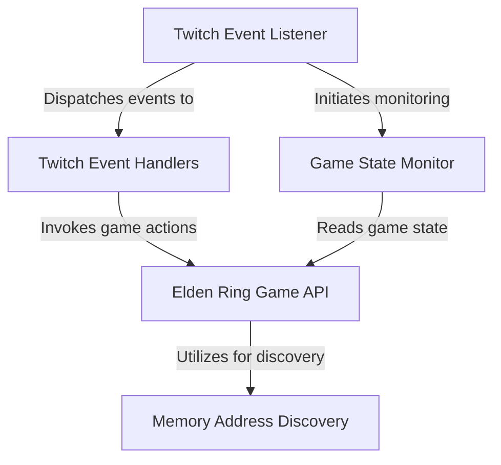

# Tutorial: elden_twitch

This project creates an *interactive experience* by connecting Twitch stream events directly to the *Elden Ring game*. It acts as a bridge, listening for actions like channel point redemptions or bit donations on Twitch and translating them into *real-time effects* within the game, such as killing the player, granting temporary buffs, or altering character appearance. It also **silently monitors** persistent game states, like player deaths, and reacts to these changes.

## Visual Overview

## Chapters

1. [Twitch Event Handlers
](01_twitch_event_handlers_.md)
2. [Elden Ring Game API
](02_elden_ring_game_api_.md)
3. [Twitch Event Listener
](03_twitch_event_listener_.md)
4. [Game State Monitor
](04_game_state_monitor_.md)
5. [Memory Address Discovery
](05_memory_address_discovery_.md)

---